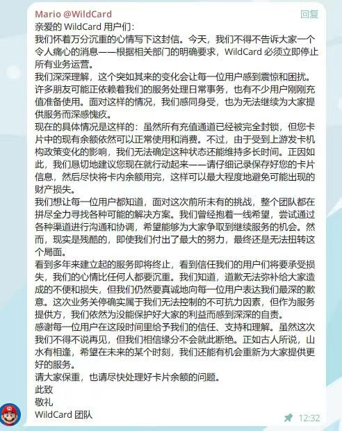
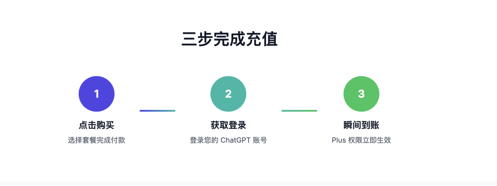
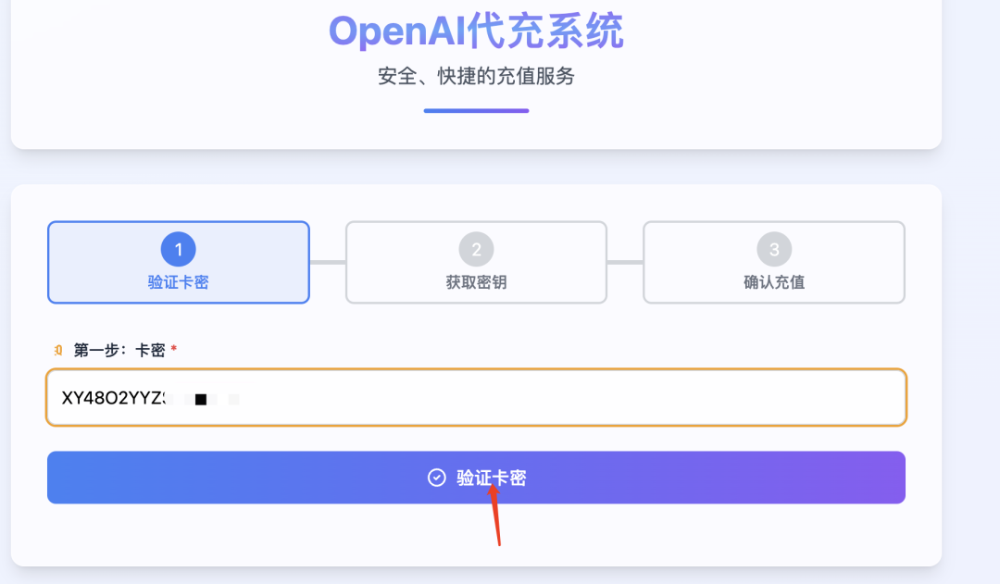
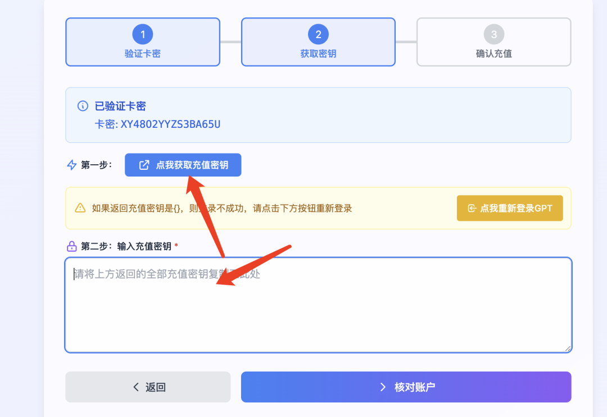
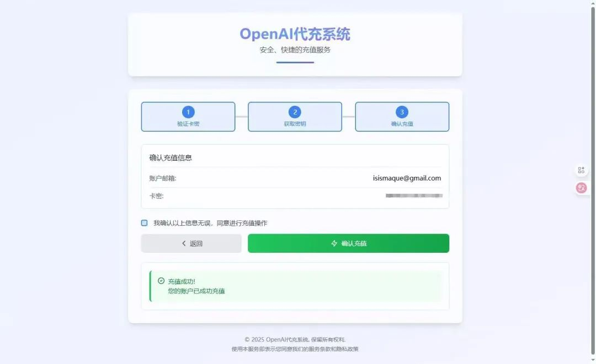

# WildCard (野卡) 跑路，可替代的 Chat GPT-4 代充值续费方案

## 背景

近期，WildCard (野卡) 平台疑似跑路，导致许多用户无法使用余额，也失去了一个稳定的 ChatGPT Plus 充值渠道。这给国内希望升级和续费 GPT-4 会员的朋友们带来了很大的困扰。

**重要提醒**：如果您在 WildCard 中还有未使用的余额，请尽快尝试将其消费完毕，后续可能将无法使用。

## 问题所在与解决思路

虚拟信用卡（如 WildCard）虽然一度是可行的方案，但始终伴随着平台不稳定、资金安全无保障的风险。对于仅仅是想要升级 ChatGPT Plus 的普通用户来说，完全没必要承担这样的风险。

**核心思路转换：** 与其冒着本金损失的风险去开通和维护一张不靠谱的虚拟卡，不如选择专业、可靠的代充值服务。这种方式更安全、更省心，也更直接。

## 推荐方案：iOS 礼品卡自动化充值平台

我在这里部署并推荐一个我自己的自动化充值平台，专门为解决国内用户升级 GPT Plus 的需求而生。全程自动化操作，安全快捷。

* **官方网站 & 视频教程**: [**http://gptplus.plus**](http://gptplus.plus) (浏览器打开即可访问)

### 方案优势

* **正规渠道**：通过苹果 App Store 的 iOS 渠道进行充值，完全合规，杜绝封号风险。
* **价格优惠**：利用部分国家/地区的汇率优势，将充值成本控制在 **130 元** 左右，极具性价比。
* **无需开卡**：没有繁琐的开卡流程，更没有额外的开卡费用。
* **稳定续费**：每月均可稳定续费，告别后顾之忧。
* **安全保障**：平台已稳定运行很长时间，至今保持 **0 封号** 记录。即便遇到极小概率的封号问题，我们承诺按天退款（尽管 iOS 官方不退款）。

## 充值步骤详解

整个过程非常简单，只需两步即可完成。

### 第一步：获取充值卡密

1.  打开卡密购买网址：
    [**https://yo.i6ls.com/links/687593ED**](https://yo.i6ls.com/links/687593ED)

2.  选择价格为 **130 元** 的商品。

3.  输入您的联系方式并完成付款。

4.  付款成功后，您将立即获得一串**卡密**，这是用于后续充值的凭证。
   

### 第二步：使用卡密进行充值

1.  打开 GPT 充值平台网址：
    [**http://gptplus.plus**](http://gptplus.plus)

2.  点击页面上的 **“24小时代充系统”** 按钮。

3.  在弹出的窗口中，输入您在第一步中获得的**卡密**进行验证。

    
4.  **登录您的 OpenAI 账户**：按照页面提示，安全登录您的 ChatGPT 账号以获取充值所需的授权密钥。

   
5.  **提交密钥并核对账户**：将获取到的充值密钥粘贴到指定输入框中。系统会自动显示您的账户信息，请仔细核对，确保是您自己的账号。
   

7.  **确认充值**：核对无误后，点击“确认充值”按钮。

系统会自动完成后续所有操作。稍等片刻，刷新您的 ChatGPT 页面，即可看到 Plus 会员已经成功到账！

> **需要帮助？**
> 如果在操作过程中遇到任何疑问，请访问 [**http://gptplus.plus**](http.gptplus.plus) 观看详细的视频教程。

## 客户支持

如果在充值过程中遇到任何问题，或有其他疑问，请随时联系网站客服获取帮助。我们致力于为您提供最稳定、最省心的服务。

